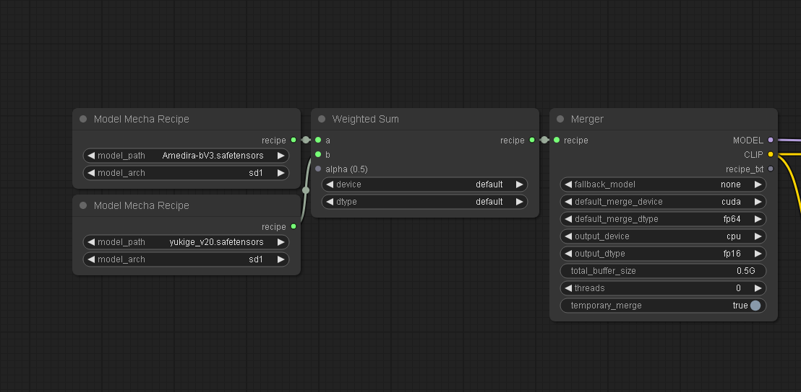

[](https://discord.gg/invite/2EPaw6fxxm)

# sd-mecha for Comfyui

comfy-mecha is a complete model merging node pack for ComfyUI with a focus on low memory footprint.  
- compose complex recipes without needing to save dozens of intermediate merges to disk
- merge loras to models
- support for block weights
- and a bunch of other stuff. For more info, see the [nodes listing](#nodes-listing) below. See also the readme of the underlying library [sd-mecha](https://github.com/ljleb/sd-mecha)

## Workflows

### Basic weighted sum



### Clipped add difference


### Ties merging


Recipe workflows can get much, much more complex than this.  
If you are familiar with writing python code, you might be interested in using the sd-mecha library directly for experiments as an alternative to ComfyUI: https://github.com/ljleb/sd-mecha

## Install

### Install with ComfyUI-Manager

Assuming you have [ComfyUI-Manager](https://github.com/ltdrdata/ComfyUI-Manager) installed:

1. Open a browser tab on ComfyUI
2. Click on the "Manager" button
3. Click on "Install Custom Nodes"
4. Search for "mecha"
5. Install "Mecha Merge Node Pack"

### Install manually

You can also install the node pack manually:

```sh
cd custom_nodes
git clone https://github.com/ljleb/comfy-mecha.git
pip install -r comfy-mecha/requirements.txt
```

## Nodes listing

### Merge nodes

Nodes used for merging. They all have `Recipe` in their name except for `Mecha Merger`.

- nodes ending in `... Mecha Recipe` return a merge recipe
- `Mecha Merger` takes a `MECHA_RECIPE` as input, and returns a unet and a text encoder
- `Serializer` takes a `MECHA_RECIPE` as input, and returns the recipe instructions using the mecha format
- `Deserializer` takes a mecha recipe string as input, and returns the deserialized `MECHA_RECIPE` (this is the inverse operation of `Serializer`)
- `Mecha Model Recipe` loads a model as a recipe to be used as input to other recipe nodes. model architecture auto-detection is not yet supported, so please make sure the right `model_arch` parameter is selected!
- `Mecha Lora Recipe` loads a lora model as a recipe to be used as input to other recipe nodes. again, model architecture auto-detection is not yet supported, so make sure to use the right `model_arch`
- `Mecha Recipe List` takes an arbitrary number of recipes and returns a `MECHA_RECIPE_LIST`. It is intended to be used as input to recipe nodes that accept an arbitrary number of recipes as input, i.e. the `bounds` input of `Clip Mecha Recipe`

### Hyper nodes

Nodes used to specify hyper(parameters) to merge methods. For example, `Weighted Sum Mecha Recipe` has a hyper input `alpha` with a default value of `0.5`.

- `Blocks Mecha Hyper` can specify a different hyper for each block of the models to be merged (AKA "merge block weighted" or "MBW")
- `Float Mecha Hyper` specifies the same float for all blocks of the models to be merged

## Extensions

To add custom merge nodes, you can add python scripts that make use of the mecha extension API under the `mecha_extensions` directory.
The node pack will run all scripts placed there before creating the comfy nodes.

Currently, the documentation for the mecha extension API is under construction.
For now, to get more information, you can either take a look at the [custom merge method example](https://github.com/ljleb/sd-mecha/blob/main/examples/custom_merge_method.py),
open a discussion post to ask questions, or [join the discord server](https://discord.gg/invite/2EPaw6fxxm).
